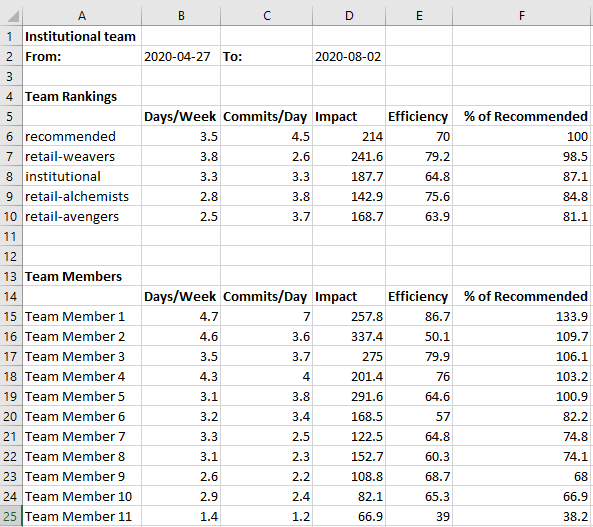

# Distributing Pluralsight Flow Stats

This Python code aims to extract team stats from the Pluralsight flow API and build and distribute the stats for each user to that user via email.  In addition, if team leader emails are configured, a summary of the teams metrics will be sent to each team lead.

### Known problems and disclaimer
We used cloud-based Flow (not on-prem) and responses to the API calls can be slow, sometimes hanging and timing out.  Killing the process and rerunning usually works.  I haven't investigated this further, but since a rerun works, it doesn't appear to be a problem with the scripts.

These scripts were built for personal use, so no guarantees of perfection.  I'm not a Python developer, it was the quickest tool to get the job done.

## Output

The script will email a detailed spreadsheet view of each developer's metrics to the developer, which also shows a comparison with the team averages and target (recommended) statistics.  In addition, the team ranking against other similar teams can be shown.


If team lead email addresses are configured, a view of the team will be emailed to each team lead:




## Setup

## Running the scripts
The entry point is `extract.py`, and the script expects a single command-line argument specifying the path to the configuration file.

Currently the script expects to interface with Microsoft Outlook to send the emails, so should be run on a Windows computer with Outlook installed.  There is code in `delivery.py` to send via an SMTP server which can be switched in if that is preferred.

````
extract.py c:/flow/config.json
````

### Configuration file
The configuration file should contain a json document with these properties:

````
{ 
	"token":"FLOW-API-KEY",
	"week-count": 13,
	"team": "institutional",
	"date-format": "%Y-%m-%d",
	"base-url": "https://flow.pluralsight.com/v3/customer/core",
    "smtp-server": "SMTP server name or IP",
    "email-from": "sender@domain.com",
    "email-suppress": "N",
	"compare-teams": "retail-alchemists,retail-avengers,retail-weavers",
    "team-leads": "team.lead.1@domain.com,team.lead.2@domain.com"
}
````

* `token` A user token for the flow API.  The user in whose name the token has been issued must have the rights on Flow to make the API calls - basically should be able to view the same data through the Flow UI.
* `week-count` How many weeks back do you want analysed and summarised.  13 = +/- 3 months.  The scripts will work on whole weeks so that the metrics calculated match those shown in the Flow UI.
* `team` Name of the team to analyse.  Each member of the team will be analysed.  The emails will be sent to the email address reported by Flow for that user.
* `date-format` Self explanatory
* `base-url` Base URL for the Flow API
* `smtp-server` Value currently expected even if not in use - obviously could be any string. 
* `email-from` Who should be shown as the sender of the emails.  
* `email-supress` `Y` - don't send emails.  Set this when testing.  Spreadsheets will be generated but not emailed.  Set to `N` when ready to send.
* `compare-teams` List of similar teams to build and display comparative metrics for
* `team-leads` List of team lead email addresses to send full team rankings to


### Python dependencies
````
# Needed for Outlook interop - devsmtp1-agct has been closed down to workstations
pip install pywin32

# Needed for Excel sheet building & manipulation
pip install xlsxwriter
````